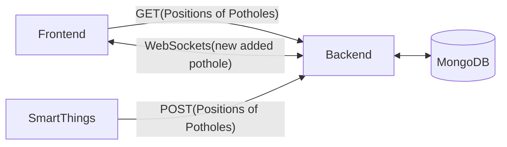

## Hi there 👋

### _SafeRoad_ is a system that allows localisation and visualization of potholes to monitor the quality of roads (we have too many in my beloved country 🇲🇦).

## The System Architecture

<!--

-->

we can break the system into 3 subsytems :

|              |                      Frontend                       |                      Backend                       |                         SmartThings                          |
| :----------: | :-------------------------------------------------: | :------------------------------------------------: | :----------------------------------------------------------: |
|   Language   |                     Javascript                      |                     Javascript                     |                            Python                            |
| Technologies |             Leaflet + Socket.io Client              |  NodeJS + ExpressJS + MongoDB + Socket.io Server   | Requests + GPS + Raspberry PI + PI Camera + Huawei 4G Dongle |
|    Repo     | https://github.com/Potholes-ai/frontend-potholes-ai | https://github.com/Potholes-ai/backend-potholes-ai |   https://github.com/Potholes-ai/smart-things-potholes-ai    |

# Demonstration Video

## [Demo Video](https://drive.google.com/file/d/1cuEcpcOaUutxG1opQEddCqUB-Nxv5CWZ/view?usp=sharing)
