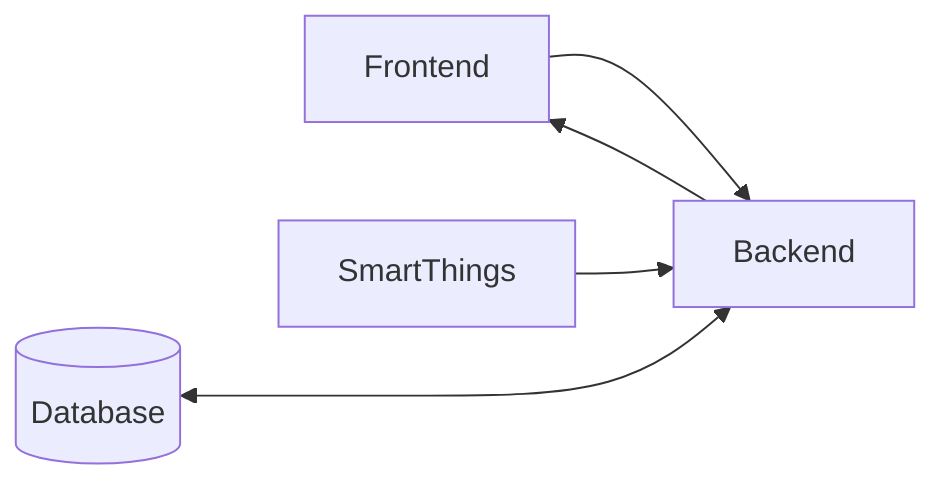

## Hi there 👋 

### SafeRoad is a project made with love, it's a system that allows localisation and visualization of potholes to monitor the quality of roads (we have too many in our beloved country Morocco).

## The System Architecture

we can break the system into 3 subsytems :

| Frontend      | Backend       | SmartThings   |
| :---: | :---: | :---: |
| Content Cell  | Content Cell  |
| Content Cell  | Content Cell  |

## Data Generation

- Smart things: Raspberry Pi 4 + Camera + GPS + Huawei 4G Dongle (E3372h-153)
- **pynmea2** library used for parsing GPS data
- **requests** library used to send post request to the server

## Server

- NodeJS ExpressJS
- Mongodb
- 🚧 Change Streams (Web Sockets)

##  [Frontend (Map)](https://github.com/Potholes-ai/frontend-potholes-ai)

- Fetch API
- Leaflet
- 🚧 WebSocket to have a realtime communication with the server (each time a new pothole is sent to the backend)

# Demonstration Video

## [Demo Video](https://drive.google.com/file/d/1cuEcpcOaUutxG1opQEddCqUB-Nxv5CWZ/view?usp=sharing)

# Used Technologies

### hardware :

- Raspberry pi 4
- Modem 4G Orange (huawei E3372h-153)
- Camera PI
- GPS b220
- PowerBank

### software :

- Python
- NodeJS
- Mongodb
- Leaflet
- 🚧 Socket.io

👩‍💻 Useful resources - where can the community find your docs? Is there anything else the community should know?

<picture>
  <source media="(prefers-color-scheme: dark)" srcset="https://user-images.githubusercontent.com/25423296/163456776-7f95b81a-f1ed-45f7-b7ab-8fa810d529fa.png">
  <source media="(prefers-color-scheme: light)" srcset="https://user-images.githubusercontent.com/25423296/163456779-a8556205-d0a5-45e2-ac17-42d089e3c3f8.png">
  
</picture>
